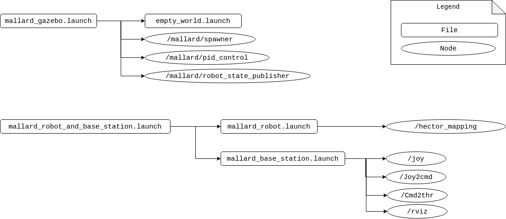
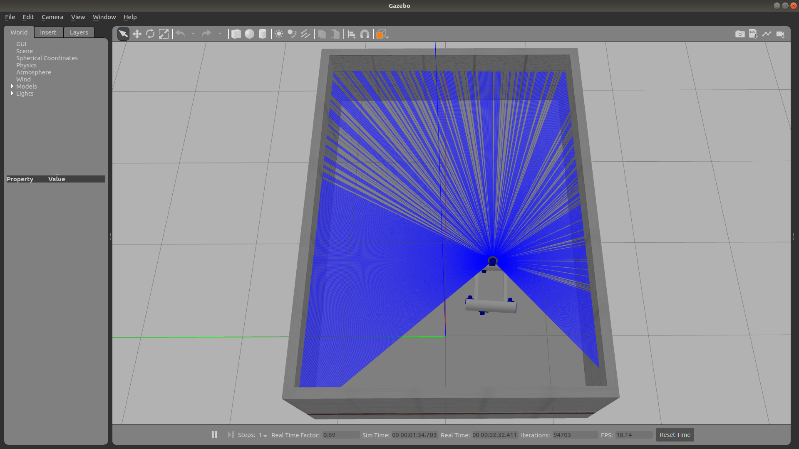
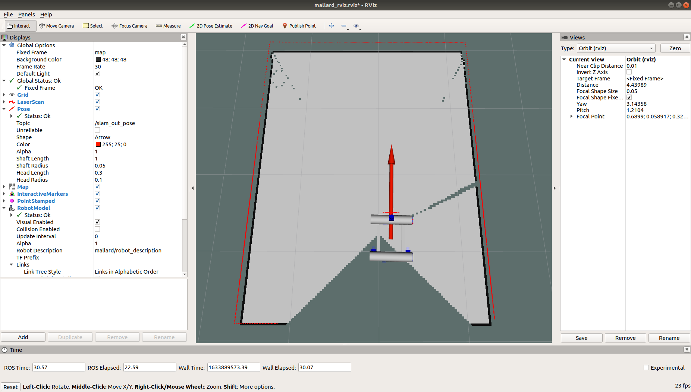

### Overview

This repository contains packages to run MallARD in simulation as manual mode.

-----


### Essential tools
Before going to the next step, please make sure you have followed 1.6 of the [ROS guide](http://wiki.ros.org/melodic/Installation/Ubuntu) so that you have essential tools such as `rosdep`.


### Clone the repository

Make a new catkin workspace (`mallard_ws` is used here as an example), change directory to the `/src` folder of your catkin workspace, clone the git repository and update the submodule (`freefloating_gazebo`). This work was built and tested on Ubuntu 18.04 with ROS Melodic.
```
mkdir -p ~/mallard_ws/src 
cd ~/mallard_ws/src
git clone https://github.com/EEEManchester/MallARD_Sim_2.git 

cd ~/mallard_ws/src/MallARD_Sim_2
git submodule init 
git submodule update 
```

### Install catkin_tools

This project is built using [catkin_tools](https://catkin-tools.readthedocs.io/en/latest/installing.html). Install catkin tools before continuing.

### Build Packages

Go to your catkin workspace and build the packages. Source the setup file to overlay your workspace on top of your environment.
```
cd ~/mallard_ws
catkin build
source devel/setup.bash 
```

You can check if your workspace is properly overlayed by checking the ROS_PACKAGE_PATH environment variable.
```
echo $ROS_PACKAGE_PATH 
```
You should be able to see something similar to the following.
```
/home/(user)/mallard_ws/src..
```
Now your workspace is recognised by the computer.


Put the command to source the file inside `.bashrc` file by running the following command so that the setup file can be automatically sourced and hence the workspace can be recognised every time a new terminal is open. 
Make sure you put `>>` not `>` as `>>` will put the line at the end of .bashrc file while `>` will overwrite the entire file, removing previous contents.
```
echo "source ~/mallard_ws/devel/setup.bash" >> ~/.bashrc
```


The following diagram shows the connection of launch files and nodes of MallARD.




### Install additional packages
#### hector_mapping
MallARD uses a package called `hector_mapping` which is not included in ROS as a default. Therefore, you need to install it separately, by the following command.

```
sudo apt install ros-melodic-hector-slam
```


#### joy
If you encounter the following error while running a launch file,
```
ERROR: cannot launch node of type [joy/joy_node]: joy_node
```
It might be because you have not installed and initialised essential tools such as `rosdep`. Please follow 1.6 of the ROS guide [here](http://wiki.ros.org/melodic/Installation/Ubuntu), build the packages again, and try running the launch file again.

If the error still occurs, install the package separately by running the following command and try running the launch file again.
```
sudo apt install ros-melodic-joy
```

#### General solution for missing packages
Please make sure you have followed 1.6 of the ROS guide [here](http://wiki.ros.org/melodic/Installation/Ubuntu).

You can check if a package is missing by running the following code:
```
rospack list
```

In general, you should be able to install a ros package using the following command.
```
sudo apt install ros-melodic-package-name
```

-----
### Run Simulation as Manual Mode

To run simulation, the two launch files in `launch_config` package (`~/mallard_ws/src/MallARD_Sim_2/launch_config/launch`) need to be launched:

- mallard_gazebo.launch  
- mallard_robot_and_base_station.launch

Follow the steps below.

1. In a terminal(Terminal 1):
```
roslaunch launch_config mallard_gazebo.launch
```
2. Wait for Gazebo to fully apper. 

3. Connect a joystick to the base station. 

4. In another terminal(Terminal 2):
```
roslaunch launch_config mallard_robot_and_base_station.launch
```

You should see windows similar to the followings: 

##### Gazebo
 

##### RViz
 

5. The simulated MallARD in Gazebo and its representation in RViz should move as you control with the joystick. 


#### Error
If you get the folloing error message when launching mallard_gazebo.launch,
```
[Err] [REST.cc:205] Error in REST request

libcurl: (51) SSL: no alternative certificate subject name matches target host name 'api.ignitionfuel.org'
```
refer to [ROS_Beginner_Teaching_Materials/GazeboErrors.md](https://github.com/EEEManchester/ROS_Beginner_Teaching_Materials/blob/main/GazeboErrors.md). 


-----
### Tips
#### Gazebo Real Time Factor
If the gazebo simulation seems slow, check `Real Time Factor` at the bottom of the Gazebo window. If it is < 1.0, it means the simulation time is slower than the real time. The reason might be because your computer is not capable enough to run (or play) the simulation with the real speed.

One way to resolve the issue is as follows.
Go to `World` tab > `Physics` > and change `real time update rate` to 0.


### Warnings
#### Warning while building the packages
The following warning occurs while building the packages.
```
CMake Warning (dev) at /usr/share/cmake-3.10/Modules/FindBoost.cmake:911 (if):
  Policy CMP0054 is not set: Only interpret if() arguments as variables or
  keywords when unquoted.  Run "cmake --help-policy CMP0054" for policy
  details.  Use the cmake_policy command to set the policy and suppress this
  warning.

  Quoted variables like "chrono" will no longer be dereferenced when the
  policy is set to NEW.  Since the policy is not set the OLD behavior will be
  used.
```

#### Warning when launching mallard_gazebo.launch
The following warning occurs when launching `mallard_gazebo.launch`
```
: The root link base_link has an inertia specified in the URDF, but KDL does not support a root link with an inertia.  As a workaround, you can add an extra dummy link to your URDF.
```
