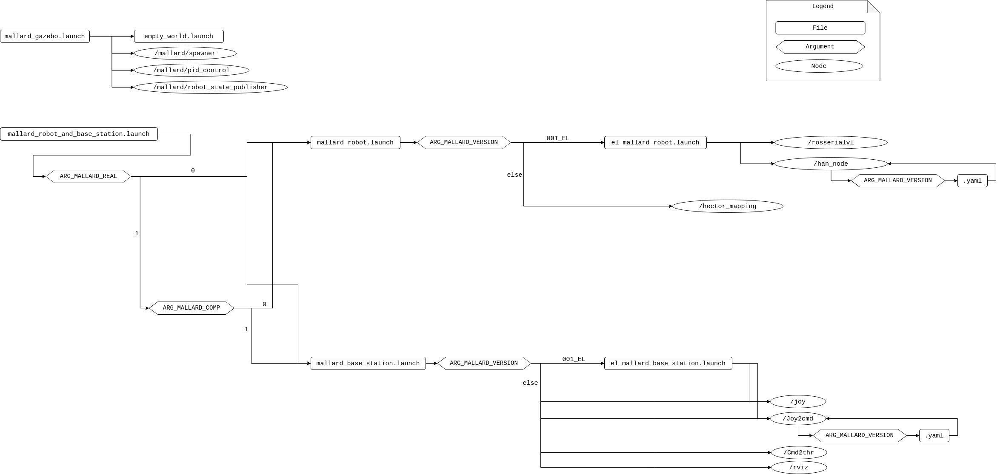
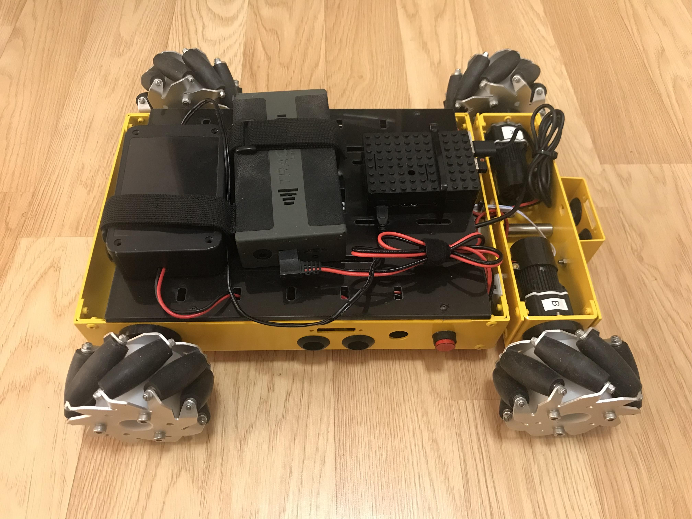

### Overview

This repository contains packages to run MallARD in simulation. 
**Autonomy is not available in this repository. To enable autonomy, the corresponding private package is required.**

-----


### Essential tools
Before going to the next step, please make sure you have followed 1.6 of the [ROS guide](http://wiki.ros.org/melodic/Installation/Ubuntu) so that you have essential tools such as `rosdep`.


### Clone the repository

Make a new catkin workspace (`mallard_ws` is used here as an example), change directory to the `/src` folder of your catkin workspace, clone the git repository and update the submodule (`freefloating_gazebo`). This work was built and tested on Ubuntu 18.04 with ROS Melodic.
```
mkdir -p ~/mallard_ws/src 
cd ~/mallard_ws/src
git clone https://github.com/EEEManchester/MallARD_Sim_2.git 

cd ~/mallard_ws/src/MallARD_Sim_2
git submodule init 
git submodule update 
```

### Install catkin_tools

This project is built using [catkin_tools](https://catkin-tools.readthedocs.io/en/latest/installing.html). Install catkin tools before continuing.

### Build Packages

Go to your catkin workspace and build the packages. Source the setup file to overlay your workspace on top of your environment.
```
cd ~/mallard_ws
catkin build
source devel/setup.bash 
```

You can check if your workspace is properly overlayed by checking the ROS_PACKAGE_PATH environment variable.
```
echo $ROS_PACKAGE_PATH 
```
You should be able to see something similar to the following.
```
/home/(user)/mallard_ws/src..
```
Now your workspace is recognised by the computer.


Source the bash file for the environment variables used for mallard by running the following command.
```
source ~/mallard_ws/src/MallARD_Sim_2/launch_config/mallard_env_variables.sh
```
Now the bash file is recognised by the computer.


Put the lines of commands to source files inside `.bashrc` file by running the following commands so that the setup file and the environment variable bash file can be automatically sourced every time a new terminal is open and hence the workspace and the environment variables can be recognised.
Make sure you put `>>` not `>` as `>>` will put the line at the end of .bashrc file while `>` will overwrite the entire file, removing previous contents.
```
echo "source ~/mallard_ws/devel/setup.bash" >> ~/.bashrc 
echo "source ~/mallard_ws/src/MallARD_Sim_2/launch_config/mallard_env_variables.sh" >> ~/.bashrc 
```

Run the following command as well for El-MallARD setup.
```
echo "alias semael='export ROS_MASTER_URI=http://10.42.0.1:11311 && export ROS_HOSTNAME=10.42.0.205'" >> ~/.bashrc 
```


### Environment Variables and Arguments
There are four environment variables which are used to determine launch setups for different circumstances.
The environment variables can be changed by modifying the bash file which is at `~/mallard_ws/src/MallARD_Sim_2/launch_config/mallard_env_variables.sh`
The environment variables with their default values are as follows.
```
MALLARD_REAL=0            # 0: Simulation Mode. 1: Real Robot Mode. 
MALLARD_COMP=1            # 0: Robot computer. 1: Base Staion comptuer. 2: another comptuer. Only relavant for Real Robot Mode.
MALLARD_AUTONOMOUS=0      # 0: Manual Mode. 1: Autonomous Mode. 
MALLARD_VERSION='001_SIM' # The version of MallARD. E.g. 001_SIM, 002_SIM, 003_SIM, 001_REAL, 002_REAL, 003_REAL, 001_EL.
```

And there are four arguments to get the values of the corresponding environment variables.
```
ARG_MALLARD_REAL
ARG_MALLARD_COMP
ARG_MALLARD_AUTONOMOUS
ARG_MALLARD_VERSION
```

Depending on the values of the arguments, the launch setups change. 

**Autonomy is not available in this repository. Therefore, `MALLARD_AUTONOMOUS` should remain as 0.**

To check that the environment variables are sourced, run the following command.
```
env | grep MALLARD
```
You should see the environment variables with their values.


#### How to change the environment variables in a terminal
If you want to change the values of environment variables for the current terminal, refer to the example commands below.
```
export MALLARD_COMP=0
source .bashrc
```

If you want to make persistent changes for new terminals as well, refer to the example commands below.
```
echo "export MALLARD_COMP=0" >> ~/.bashrc  #the command inside the quote gets written in .bashrc so that it applies to all the new terminals.
source .bashrc                             #for the current terminal.
```

You can check the variables using `env`.  


The following diagram shows the connection of launch files, arguments, and nodes of MallARD.




### Install additional packages
#### hector_mapping
MallARD uses a package called `hector_mapping` which is not included in ROS as a default. Therefore, you need to install it separately, by the following command.

```
sudo apt install ros-melodic-hector-slam
```


#### joy
If you encounter the following error while running a launch file,
```
ERROR: cannot launch node of type [joy/joy_node]: joy_node
```
It might be because you have not installed and initialised essential tools such as `rosdep`. Please follow 1.6 of the ROS guide [here](http://wiki.ros.org/melodic/Installation/Ubuntu), build the packages again, and try running the launch file again.

If the error still occurs, install the package separately by running the following command and try running the launch file again.
```
sudo apt install ros-melodic-joy
```

#### General solution for missing packages
Please make sure you have followed 1.6 of the ROS guide [here](http://wiki.ros.org/melodic/Installation/Ubuntu).

You can check if a package is missing by running the following code:
```
rospack list
```

In general, you should be able to install a ros package using the following command.
```
sudo apt install ros-melodic-package-name
```

-----
### Run Simulation as Manual Mode

To run simulation, the two launch files in `launch_config` package (`~/mallard_ws/src/MallARD_Sim_2/launch_config/launch`) need to be launched:

- mallard_gazebo.launch  
- mallard_robot_and_base_station.launch

Follow the steps below.

1. In a terminal(Terminal 1):
```
roslaunch launch_config mallard_gazebo.launch
```
2. Wait for Gazebo to fully apper. 

3. Connect a joystick to the base station. 

4. In another terminal(Terminal 2):
```
roslaunch launch_config mallard_robot_and_base_station.launch
```

You should see windows similar to the following: 

##### Gazebo
 

##### RViz
 

5. The simulated MallARD in Gazebo and its representation in RViz should move as you control with the joystick. 


#### Error
If you get the folloing error message when launching mallard_gazebo.launch,
```
[Err] [REST.cc:205] Error in REST request

libcurl: (51) SSL: no alternative certificate subject name matches target host name 'api.ignitionfuel.org'
```
refer to [ROS_Beginner_Teaching_Materials/GazeboErrors.md](https://github.com/EEEManchester/ROS_Beginner_Teaching_Materials/blob/main/GazeboErrors.md). 


### El-MallARD
El-MallARD is the ground version of MallARD, which mimics the behaviour of MallARD.




#### Environment Variable setup
Before running El-MallARD, set environment variables for the real robot and the base station as follows.

For the real robot (this should have already been set in the real robot computer),
```
MALLARD_REAL=1            # Real Robot Mode
MALLARD_COMP=0            # Robot Computer
MALLARD_AUTONOMOUS=0      # Manual Mode
MALLARD_VERSION='001_EL'  # Configuration for El-MallARD
```

For the base station,
```
MALLARD_REAL=1            # Real Robot Mode
MALLARD_COMP=1            # Base Station Computer
MALLARD_AUTONOMOUS=0      # Manual Mode
MALLARD_VERSION='001_EL'  # Configuration for El-MallARD
```

When you have changed environment variables, don't forget to source `.bashrc` file.


#### Connect to El-MallARD, Run and Turn Off
On El-MallARD, 

1. Turn on El-MallARD by pressing the red button on the side of El-MallARD. Check if the Raspberry Pi's red LED is on.  

On the base station, 

2. Connect a joystick to the base station.

3. Change the WiFi to 'robot wifi' which is the hotspot generated by El-MallARD.

4. In a terminal(Terminal 1), run the following commands.
```
ssh keir@10.42.0.1
# insert password
semael
roslaunch launch_config mallard_robot_and_base_station.launch
```

5. In another terminal(Terminal 2), run the following commands.
```
semael
roslaunch launch_config mallard_robot_and_base_station.launch
```

6. El-MallARD should move as you control with the joystick.  

After use,

7. Shutdown the processes by pressing Ctrl + C in the terminals.

8. Shutdown Raspberry Pi properly with the following command in Terminal 1.
```
sudo shutdown -h now
```

Wait 10+ seconds for the Raspberry Pi to completely shutdown.

9. Turn off El-MallARD by pressing the red button. Check if the Raspberry Pi's red LED is off.


#### Modes and Buttons
El-MallARD has two modes: `Velocity Control Mode` and `Boat Mode`. You can toggle between the modes using buttons on the joystick.

`Velocity Control Mode`(default): Button `L1`    
The scaled joystick inputs indicates the body velocities and are directly converted to the wheel velocities.

`Boat Mode`: Button `R1`    
The behaviour of MallARD on water is implemented.
The body velocities are calculated using the previous velocities, inertia and drag as well as the current input velocities (scaled joystick inputs) and then converted to the wheel velocities.

`Stop`: Button `X`     
The wheels of the robot immediately stop with all the velocities set to 0.


### Configuration for Different Versions of MallARD
You can choose configuration for different versions of MallARD by selecting one of the yaml files, which is done by setting the value of `MALLARD_VERSION`. For example, `MALLARD_VERSION='001_SIM'`. The availalbe examples are 001_SIM, 002_SIM, 003_SIM, 001_REAL, 002_REAL, 003_REAL, and 001_EL. 

Each yaml file has parameters for the corresponding MallARD's control such as velocity control (`~/mallard_ws/src/MallARD_Sim_2/el_mallard/src/han_code.py`).
You can modify the yaml files which are at `~/mallard_ws/src/MallARD_Sim_2/launch_config/(version)/cfg/yaml`


-----
### Tips
#### Gazebo Real Time Factor
If the gazebo simulation seems slow, check `Real Time Factor` at the bottom of the Gazebo window. If it is < 1.0, it means the simulation time is slower than the real time. The reason might be because your computer is not capable enough to run (or play) the simulation with the real speed.

One way to resolve the issue is as follows.
Go to `World` tab > `Physics` > and change `real time update rate` to 0.

Refer [here](https://answers.gazebosim.org/question/25190/how-to-increase-real-time-factor-while-doing-simulation/).


### Warnings
#### Warning while building the packages
The following warning occurs while building the packages.
```
CMake Warning (dev) at /usr/share/cmake-3.10/Modules/FindBoost.cmake:911 (if):
  Policy CMP0054 is not set: Only interpret if() arguments as variables or
  keywords when unquoted.  Run "cmake --help-policy CMP0054" for policy
  details.  Use the cmake_policy command to set the policy and suppress this
  warning.

  Quoted variables like "chrono" will no longer be dereferenced when the
  policy is set to NEW.  Since the policy is not set the OLD behavior will be
  used.
```

#### Warning when launching mallard_gazebo.launch
The following warning occurs when launching `mallard_gazebo.launch`
```
: The root link base_link has an inertia specified in the URDF, but KDL does not support a root link with an inertia.  As a workaround, you can add an extra dummy link to your URDF.
```
